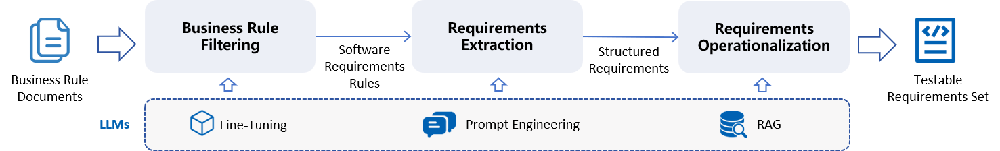

# FinTestReq


FinTestReq is a prototype tool for automated extracting testable requirements from financial rule documents using LLMs. It is the official implementation for paper [Testable Requirements Extraction in Fintech Business Rules Using LLMs](). The proposed framework is shown below. Our framework is composed of 3 steps: I. Business Rule Filtering, II. Requirements Extraction, and III. Requirements Operationalization. We use LLM adaption approaches such as fine-tuning, prompt engineering, and RAG for the 3 steps, respectively. Experimental Results shows that our framework outperforms the state-of-art LLMs including DeepSeek-R1, GPT-4, and GLM-4 on the testability and accuracy of generated requirements.





## Installation
All experiments and the following steps are conducted on Ubuntu:22.04

1. Install dependencies.

    ```bash
    sudo apt update
    sudo apt upgrade -y
    sudo apt install build-essential zlib1g-dev libbz2-dev libncurses5-dev libgdbm-dev libnss3-dev libssl-dev libreadline-dev libffi-dev
    sudo apt-get install -y libgl1-mesa-dev
    sudo apt-get install libglib2.0-dev
    sudo apt install wget
    sudo apt install git
    ```

2. Install miniconda.

    ```bash
    cd ~
    wget https://repo.anaconda.com/miniconda/Miniconda3-latest-Linux-x86_64.sh
    bash Miniconda3-latest-Linux-x86_64.sh
    source ~/.bashrc
    ```

3. Create a virtual python environment and install the required dependencies.
    ```bash
    git clone https://github.com/AnonymousAuthorsForRE2025/FinTestReq.git
    cd FinTestReq
    conda create -n FinTestReq python=3.10
    conda activate FinTestReq
    pip install -r requirements.txt
    pip install -e .
    ```


## Usage and Model Training

1. Business Rule Filtering.

    ```bash
    cd ours  
    python document_to_rule.py --file {document_to_process}  
    python rule_filtering.py
    ```
    The selected software requirement-related rules are saved at [**cache/requirement_relatd_rules.json**](./ours/cache/requirement_relatd_rules.json), the classification result for all rules are saved at [**cache/rule_filtering_output.json**](./ours/cache/rule_filtering_output.json).

2. Requirement Information Extraction.
   
    1. Input the prompt in [**ours/requirement_information_extraction_prompt.txt**](./ours/requirement_information_extraction_prompt.txt) to DeepSeek-R1.  
    2. Input the selected software requirement-related rules.
    3. Record the output.


3. Requirement Operationalization.

    1. Input the prompt in [**ours/requirement_operationalization_prompt.txt**](./ours/requirement_operationalization_prompt.txt) and upload the domain knowledge in [**../corpus/knowledge.json**](./corpus/domain_knowledge/knowledge.json) to DeepSeek-R1/GLM-4/GPT-4.  
    2. Input the selected software requirement-related rules.
    3. Record the output.


4. Rule Filtering Model Training.
    
    To train the LLM for business rule filtering, run:

    ```
    cd train_llm
    bash train_llm.sh
    ```

    After the model finish training, the training information such as loss are saved in **output/train_llm.log**. The trained model are saved at **output/mengzi_rule_filtering_{timestamp}**. The verification results are saved in **predict_data/validate_mengzi_rule_filtering_{timestamp}.json**.


## Project Structure

### Corpus
This directory save the data used in our project, for training LLMs, prompt LLMs, and conducting experiments.

> - [**document/**](./corpus/document/)  The 20 financial trade documents used in our project.
> - [**domain_knowledge/**](./corpus/domain_knowledge/)  Financial domain knowledge.
> - [**extraction_data/**](./corpus/extraction_data/)  The annotated data for requirement information extraction, including the rules and their requirement information.
> - [**filtering_data/**](./corpus/filtering_data/)  The annotated data for business rule filtering, including the rules and their types.

### train_llm
This directory provides codes and scripts for fine-tuning LLMs for business rule filtering.

> - [**output/**]()  Save the fine-tuned LLMs and logs.
> - [**predict_data/**](./train_llm/predict_data/)  Save the validation result of fine-tuned LLMs.
> - [**arguments.py**](./train_llm/arguments.py)  The hyper-parameters used in the fine-tuning process.
> - [**data_loader.py**](./train_llm/data_loader.py)  The loading process of the training and validation datasets.
> - [**train.py**](./train_llm/train.py)  The training process for business rule filtering.
> - [**validate.py**](./train_llm/validate.py)  The validation process for the fine-tuned LLMs.
> - [**train_llm.sh**](./train_llm/validate.py)  Script to train and validate.

### ours
This directory provides codes and prompts to perform the 3 steps in our framework, including business requirement filtering, requirement information extraction, and requirement operationalization.

> - [**cache/**](./ours/cache/)  Save the intermediate results.
> - [**document_to_rule.py**](./ours/document_to_rule.py)  Read documents in *pdf* or *txt* format and select rules from the documents by **ID**.
> - [**organize_knowledge.py**](./ours/organize_knowledge.py)  Encode and Decode the domain knowledge.
> - [**rule_filtering.py**](./ours/rule_filtering.py)  Process business rule filtering to the selected rules using the trained LLM.
> - [**requirement_information_extraction_prompt.txt**](./ours/requirement_information_extraction_prompt.txt)  Prompt for requirement information extraction using DeepSeek-R1.
> - [**requirement_operationalization_prompt.txt**](./ours/requirement_operationalization_prompt.txt)  Prompt for requirement operationalization using DeepSeek-R1, GLM-4, or GPT-4.

### experiment
This directory shows the experimental data and result.

> - [**dataset/**](./experiment/dataset/)  The 5 evaluation datasets used in our experiment.
> - [**exp1/**](./experiment/exp1/)  Testable requirements extracted by 4 tools/LLMs.  
>       - [**deepseek/**](./experiment/exp1/deepseek/)  Testable requirements extracted by DeepSeek-R1 through an end-to-end manner.  
>       - [**glm/**](./experiment/exp1/glm/)  Testable requirements extracted by GLM-4 through an end-to-end manner.  
>       - [**gpt/**](./experiment/exp1/gpt/)  Testable requirements extracted by GPT-4 through an end-to-end manner.  
>       - [**ours/**](./experiment/exp1/ours/)  Testable requirements extracted by our approach.  
> - [**exp2/**](./experiment/exp1/)  Testable requirements extracted by our approach using 3 different LLMs to perform requirement operationalization.  
>       - [**deepseek/**](./experiment/exp1/deepseek/)  Testable requirements extracted by our approach using DeepSeek-R1.  
>       - [**glm/**](./experiment/exp1/glm/)  Testable requirements extracted by our approach using GLM-4.  
>       - [**gpt/**](./experiment/exp1/gpt/)  Testable requirements extracted by our approach using GPT-4.  
> - [**exp_result.xlsx**](./experiment/exp_result.xlsx)  The experimental result.

### model

> - [**model/**](./model/)  
>       - [**model/mengzi-bert-base-fin/**](./model/mengzi-bert-base-fin/)  The pretrained LLM.  
>       - [**model/mengzi_rule_filtering/**](./model/mengzi_rule_filtering/)  The fine-tuned LLM for requirement filtering.

